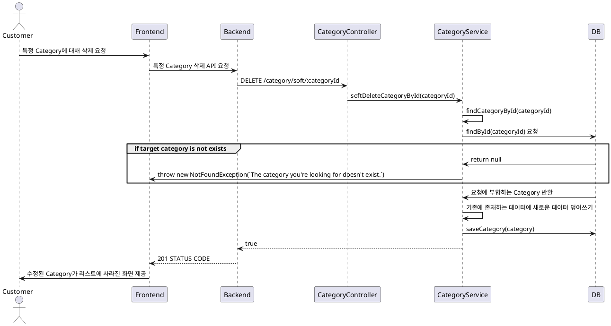

# Category 삭제 프로세스

### 유스케이스 명: Category 삭제 (DELETE category)

**선행 조건**:

**기본 흐름**:

1. 유저가 Category를 삭제할 수 있는 모달 혹은 페이지로 진입한다.
2. 특정 Category를 삭제한다.
3. 프론트엔드는 백엔드로 특정 Category 삭제에 대한 API 요청을 한다. DELETE /category/soft/:categoryId
4. 백엔드 Validator는 categoryId가 UUID인지, 제공된 데이터가 올바른 타입인지 확인한다.
5. 백엔드는 해당 categoryId가 DB에 존재하는지 확인한다.
6. 백엔드는 해당 Category의 deleted 타입을 true로 바꾼 후 저장한다.

**대안 흐름**:

**후행 조건**:

**특별 요구 사항**:

**비즈니스 규칙**:

1. 절대적 삭제가 아닌 유연한 삭제 처리한다.

