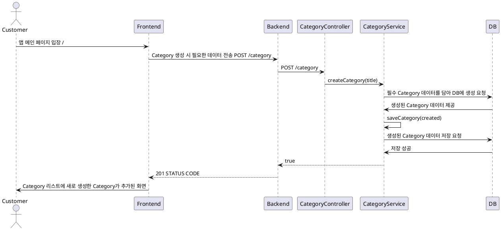

# Category 등록 프로세스

### 유스케이스 명: Category 등록 (Post category)

**선행 조건**:

- 필수 전달 데이터인 타이틀은 최소 3자 이상이어야 한다.

**기본 흐름**:

1. 유저가 앱에 접속한다.
2. Todolist를 분류할 수 있는 Category로 만든다.
3. Category의 필수 정보를 담아야한다.
   - 타이틀 string & MinLength<3>
4. 프론트엔드는 필수 정보를 담아 백엔드에 요청을 보낸다.
5. 백엔드는 받은 데이터 처리 후 201 STATUS CODE를 반환한다.

**대안 흐름**:

**후행 조건**:

**특별 요구 사항**:

**비즈니스 규칙**:

