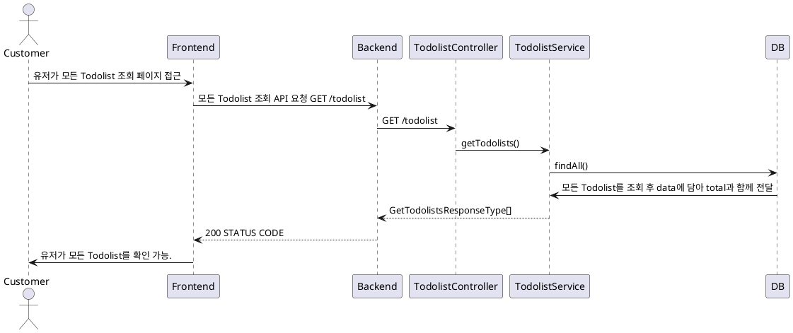
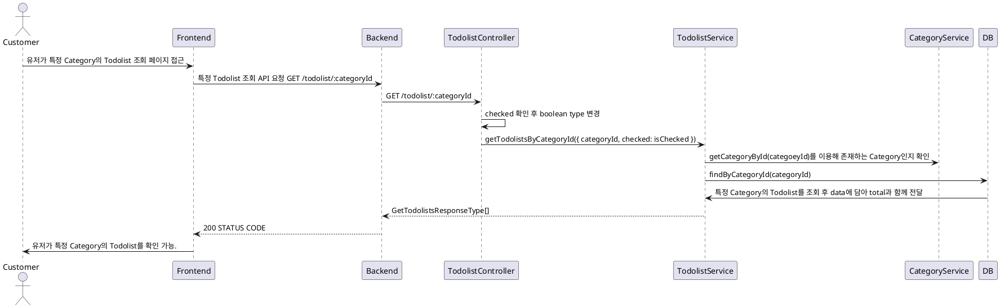
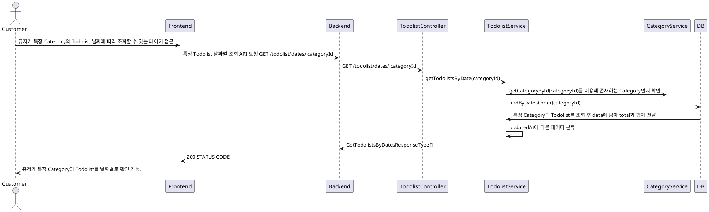

# Todolist 조회 프로세스

### 유스케이스 명: Todolist 조회 (Get todolist)

**선행 조건**:

**기본 흐름**:

1. 유저가 모든 Todolist를 조회하는 페이지에 접근한다.
2. 프론트엔드는 모든 todolist를 조회하는 API를 요청한다.
3. 백엔드는 요청에 따라 모든 todolist를 data에 담아 total 개수와 함께 반환한다
4. 프론트엔드는 모든 todolist를 정해진 형식에 맞게 유저에게 보여준다.

**대안 흐름**:

**후행 조건**:

**특별 요구 사항**:

**비즈니스 규칙**:



### 유스케이스 명: 특정 Category Todolist 조회 (Get todolist with categoryId, query)

**선행 조건**:

**기본 흐름**:

1. 유저가 특정 Category를 클릭하여 해당 Category의 todolist를 볼 수 있는 화면으로 이동
2. 프론트엔드는 백엔드에게 해당 Category에 해당하는 모든 todolist 호출 API 요청
3. 호출 시에 query로 checked가 true인지 false인지를 선택해서 호출할 수 있다.
4. 백엔드는 해당 Category ID가 UUID 타입인지 확인한다.
5. 또한 query로 checked = 'true' | 'false'가 들어왔다면 이를 boolean type으로 변환한다.
6. 들어오지 않았을 시에 checked는 false로 지정한다.
7. 이후 해당하는 Category가 존재하는지 확인한다.
8. 존재하는 Category일 경우 해당 Category와 관계가 있는 todolist를 data에 넣어 total값과 함께 반환한다.
9. 프론트엔드는 해당 Category와 관계가 있는 Todolist를 유저에게 보여준다.

**대안 흐름**:

**후행 조건**:

**특별 요구 사항**:

**비즈니스 규칙**:



### 유스케이스 명: 특정 Category Todolist dates에 따라 조회 (Get todolist with categoryId, query)

**선행 조건**:

**기본 흐름**:

1. 유저가 특정 Category의 Todolist를 날짜별로 볼 수 있는 페이지 접근
2. 프론트엔드는 백엔드에게 해당 Category에 해당하는 모든 todolist를 날짜별로 나뉜 데이터 호출 API 요청
3. 백엔드는 해당 Category ID가 UUID 타입인지 확인한다.
4. 해당하는 Category가 존재하는지 확인한다.
5. Category가 있다면 DB에 해당하는 Category에 존재하는 모든 todolist 데이터 중 checked가 true인 경우만 가져온다.
6. todolist에 updatedAt에 기반하여 데이터를 날짜별로 분류한다.
7. 정리된 데이터를 total과 함께 프론트엔드로 반환한다.

**대안 흐름**:

**후행 조건**:

**상세 타입**:

```typescript
GetTodolistsByDatesResponseType {
    data:
        dates: {
            date: string;
            todolists: Todolist[];
        }[],
        total: number
}
```

**특별 요구 사항**:

**비즈니스 규칙**:


