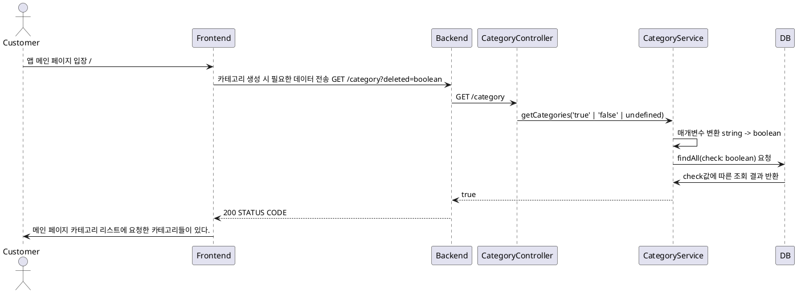

# 카테고리 조회 프로세스

### 유스케이스 명: 카테고리 조회 (Get category)

**선행 조건**:

**기본 흐름**:

1. 유저가 앱 메인 페이지['/'] 에 접속한다.
2. 투두리스트를 담은 카테고리들의 리스트를 요청한다.
3. 프론트엔드는 요청에 따라 쿼리에 deleted를 추가해 보낸다.
4. 프론트엔드가 쿼리에 아무것도 담지 않을시에 백엔드는 deleted가 false인 값만 보내준다.

**대안 흐름**:

**후행 조건**:

**특별 요구 사항**:

**비즈니스 규칙**:

