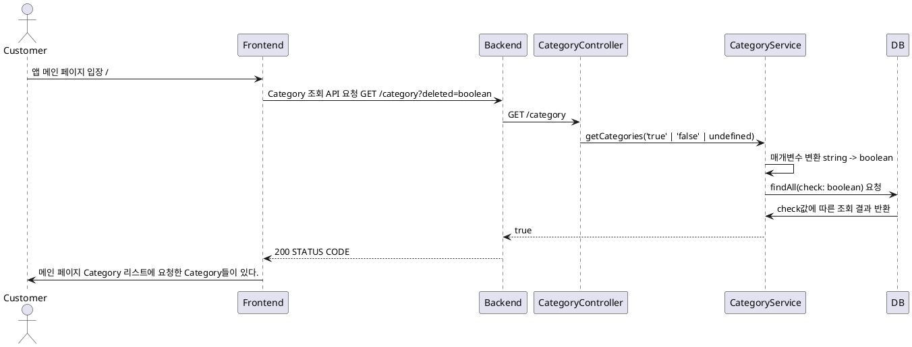
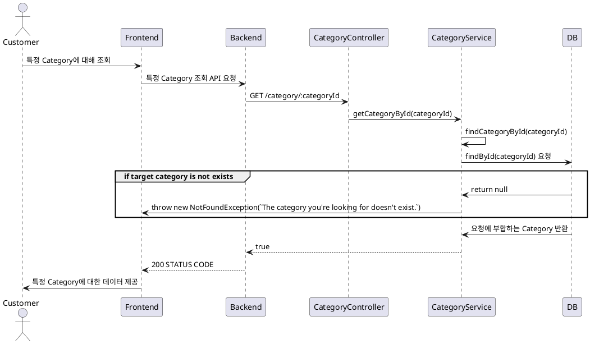

# Category 조회 프로세스

### 유스케이스 명: Category 조회 (Get category)

**선행 조건**:

**기본 흐름**:

1. 유저가 앱 메인 페이지['/'] 에 접속한다.
2. Todolist를 담은 Category들의 리스트를 요청한다.
3. 프론트엔드는 요청에 따라 쿼리에 deleted를 추가해 보낸다.
4. 프론트엔드가 쿼리에 아무것도 담지 않을시에 백엔드는 deleted가 false인 값만 보내준다.

**대안 흐름**:

**후행 조건**:

**특별 요구 사항**:

**비즈니스 규칙**:

### 유스케이스 명: 특정 Category 조회 (Get category)

**선행 조건**:

**기본 흐름**:

1. 유저가 특정 Category 조회를 요청한다.
2. 프론트엔드는 Category 조회에 대한 모달 혹은 페이지 이동을 한다. 3. 프론트엔드는 백엔드에 Category 조회 API를 요청한다 GET /category/:categoryId
3. 백엔드는 categoryId가 UUID 타입이 맞는지 확인한다.
4. UUID타입이 맞다면 이후에 DB에 존재하는 categoryID인지 확인한다.
5. 백엔드는 올바른 Category를 반환한다.

**대안 흐름**:

1. 현재 Validator가 params로 들어오는 데이터가 UUID인지 확인하는데 과한 체크인 것 같음.
2. DB에 해당하는 id가 없으면 어차피 error를 반환한다.
3. validator 수정 논의 필요.

**후행 조건**:

**특별 요구 사항**:

**비즈니스 규칙**:

