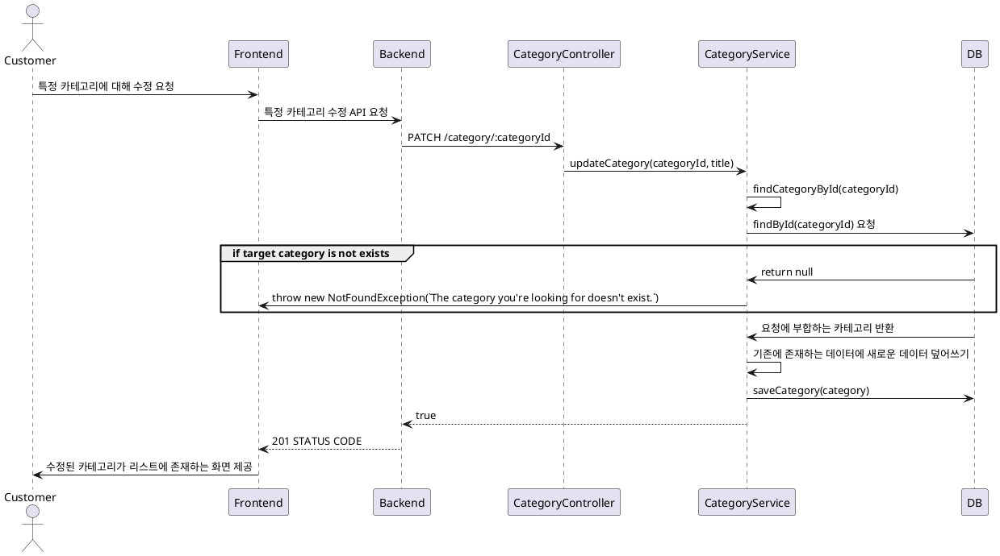

# 카테고리 수정 프로세스

### 유스케이스 명: 카테고리 수정 (PATCH category)

**선행 조건**:

**기본 흐름**:

1. 유저가 카테고리를 수정할 수 있는 모달 혹은 페이지로 진입한다.
2. 특정 카테고리에서 수정에 필요한 데이터들을 입력한 후 프론트엔드에 제공한다.
3. 프론트엔드는 백엔드로 필요한 데이터들을 제공한다. PATCH /category/:categoryId
4. 백엔드 Validator는 categoryId가 UUID인지, 제공된 데이터가 올바른 타입인지 확인한다.
5. 백엔드는 해당 categoryId가 DB에 존재하는지 확인한다.
6. 백엔드는 필수 데이터를 새로 작성하여 존재하는 category 데이터에 덮어쓴다.

**대안 흐름**:

**후행 조건**:

**특별 요구 사항**:

**비즈니스 규칙**:

