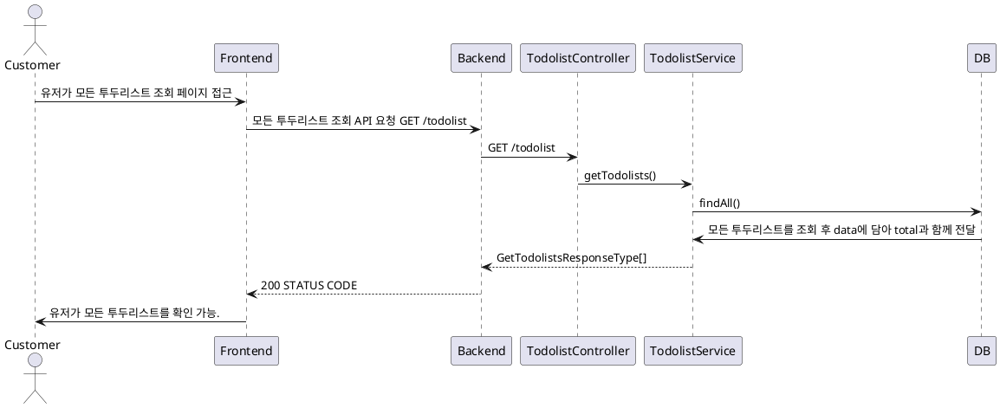
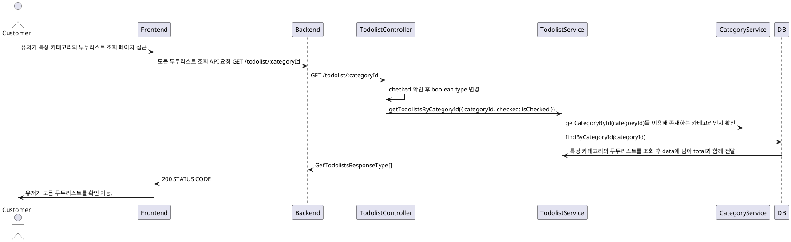

# 투두리스트 조회 프로세스

### 유스케이스 명: 투두리스트 조회 (Get todolist)

**선행 조건**:

**기본 흐름**:

1. 유저가 모든 투두리스트를 조회하는 페이지에 접근한다.
2. 프론트엔드는 모든 todolist를 조회하는 API를 요청한다.
3. 백엔드는 요청에 따라 모든 todolist를 data에 담아 total 개수와 함께 반환한다
4. 프론트엔드는 모든 todolist를 정해진 형식에 맞게 유저에게 보여준다.

**대안 흐름**:

**후행 조건**:

**특별 요구 사항**:

**비즈니스 규칙**:

### 유스케이스 명: 특정 카테고리 투두리스트 조회 (Get todolist with categoryId, query)

**선행 조건**:

**기본 흐름**:

1. 유저가 특정 카테고리를 클릭하여 해당 카테고리의 todolist를 볼 수 있는 화면으로 이동
2. 프론트엔드는 백엔드에게 해당 카테고리에 해당하는 모든 todolist 호출 API 요청
3. 호출 시에 query로 checked가 true인지 false인지를 선택해서 호출할 수 있다.
4. 백엔드는 해당 카테고리 ID가 UUID 타입인지 확인한다.
5. 또한 query로 checked = 'true' | 'false'가 들어왔다면 이를 boolean type으로 변환한다.
6. 들어오지 않았을 시에 checked는 false로 지정한다.
7. 이후 해당하는 카테고리가 존재하는지 확인한다.
8. 존재하는 카테고리일 경우 해당 카테고리와 관계가 있는 todolist를 data에 넣어 total값과 함께 반환한다.
9. 프론트엔드는 해당 카테고리와 관계가 있는 투두리스트를 유저에게 보여준다.

**대안 흐름**:

**후행 조건**:

**특별 요구 사항**:

**비즈니스 규칙**:

