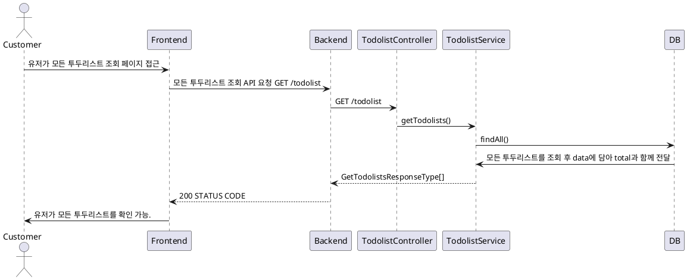

# 투두리스트 조회 프로세스

### 유스케이스 명: 투두리스트 조회 (Get todolist)

**선행 조건**:

**기본 흐름**:

1. 유저가 모든 투두리스트를 조회하는 페이지에 접근한다.
2. 프론트엔드는 모든 todolist를 조회하는 API를 요청한다.
3. 백엔드는 요청에 따라 모든 todolist를 data에 담아 total 개수와 함께 반환한다
4. 프론트엔드는 모든 todolist를 정해진 형식에 맞게 유저에게 보여준다.

**대안 흐름**:

**후행 조건**:

**특별 요구 사항**:

**비즈니스 규칙**:

