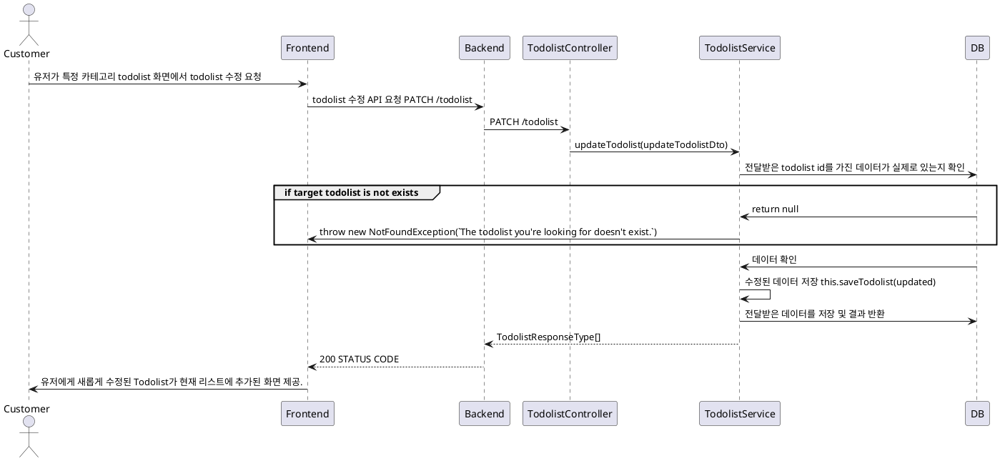
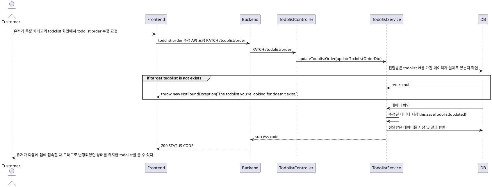

# Todolist 수정 프로세스

### 유스케이스 명: Todolist 수정 (PATCH todolist)

**선행 조건**:

**기본 흐름**:

1. 유저가 특정 카테고리의 todolist 수정 화면으로 접근 후 필수 데이터를 담아 프론트엔드에 수정을 요청한다.
2. 프론트엔드는 유저가 넘겨준 필수 데이터를 다시 백엔드 todolist PATCH API를 요청한다
3. 백엔드는 넘겨준 데이터가 올바른 형식인지 체크한다.
4. 이후에 해당 todolist id를 가진 데이터가 실제로 존재하는지 체크한다.
5. 새로 받아온 데이터로 기존 데이터를 수정한 후 DB에 저장을 요청한다.

**대안 흐름**:

**후행 조건**:

**특별 요구 사항**:

**비즈니스 규칙**:

# Todolist order 수정 프로세스

### 유스케이스 명: Todolist order 수정 (PATCH todolist order)

**선행 조건**:

**기본 흐름**:

1. 유저가 특정 카테고리의 todolist에 드래그를 이용하여 todolist간 순서를 변경한다.
2. 프론트엔드는 이를 감지하여 변경된 todolist들의 순서를 담아 백엔드에 수정 요청을 보낸다.
3. 백엔드는 넘겨준 데이터가 올바른 형식인지 체크한다.
4. 이후에 해당 todolist들의 id를 가진 데이터들이 실제로 존재하는지 체크한다.
5. 새로 받아온 데이터로 기존 데이터를 수정한 후 DB에 저장을 요청한다.

**대안 흐름**:

**후행 조건**:

**특별 요구 사항**:

**비즈니스 규칙**:

