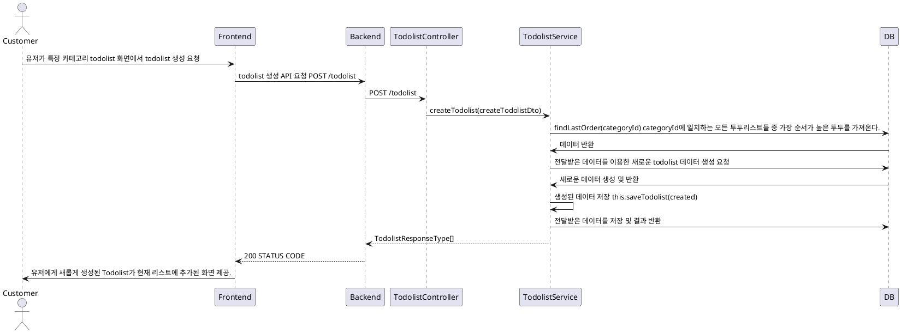

# Todolist 생성 프로세스

### 유스케이스 명: Todolist 생성 (Post todolist)

**선행 조건**:

**기본 흐름**:

1. 유저가 특정 카테고리의 todolist 화면으로 접근 및 생성을 요청한다.
2. 프론트엔드는 유저가 제공해준 필수 데이터를 담아 백엔드에 생성 API를 요청한다.
3. 백엔드는 필수 데이터인 title과 categoryId가 타입 형식에 맞게 잘 전달되었는지 확인한다.
4. 필수 데이터를 이용해서 새로운 todolist 데이터를 만든 후 저장한다.
5. 프론트엔드에게 생성된 데이터 결과값을 전달한다.
6. 프론트엔드는 유저에게 생성된 Todolist가 존재하는 화면을 보여준다.

**대안 흐름**:

**후행 조건**:

**특별 요구 사항**:

**비즈니스 규칙**:

